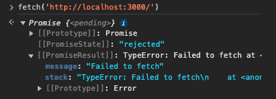
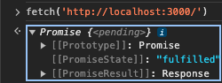

# Frontend Setup, Wireframes

## Setup and Steps
### As it relates to Dependencies
* dependencies in node projects are installed via package.json and they can be installed using `npm install --save my-dependency`/`npm install`
### Setup
0. ran `npm init -y` (initialize project with node) `created package.json` -> `npm i express` (install express) -> `npm i nodemon -D` (continue to run server with all desired changes) -> (in package.json) edited 'scripts' to include 'node sever' for 'start', 'nodemon sever' for 'dev'
1. added code to server.js
    - express -> app -> PORT -> app.listen() -> `npm run dev`

## TO-DO (12/11/23)
* going to go with SuperTokens for user auth as opposed to Clerk
[ ] - provide a sign up route
[ ] - provide login route
[ ] - provide user account page
* for fonts, used `https://fonts.google.com/specimen/Graduate?query=graduate&sort=popularity`

## 12/16/23
* (eventually) going with stylex (fb) for styling paired with react comps `npm install --save @stylexjs/stylex`
    - using styling video guide for initial setup
* able to get page on localhost:3000 saying content in all of the provided text in css
* able to get page that directs user to not found page
* installed date-fns, uuid for logger middleware

## 12.24.23
- React ARIA is also a possible, strong option for design with using unstyled comps that are responsive
- installed esLint for stylex in order to catch errors in styling, provides validation `npm install --save-dev @stylexjs/eslint-plugin`
- implemented logger.js which outputs logs per request in /logs
    * __NEED__: to refine the logger middleware to only care about specific desired requests

## 12.25.23
- Installed SuperTokens via CLI `npm i -s supertokens-auth-react`
- installed cookie-parser via `npm i cookie-parser`
- Need to be able to pass pre-flight requests to solve CORS
    * (1) `npm i cors` -> (2) added cors to `server.js` via `const cors = require('cors)`
    * with cors options only allow requests we want:
        1. added an `allowedOrigins.js` that includes sites that can process requests
        2. then we add a `corsOptions.js` that tells cors to look at the included sites in allowedOrigins
        3. in server.js, add `app.use(cors(corsOptions))` that now reflects a difference as it pertains to requests
            - google not included in allowedOrigins
                - `Error: Not allowed by CORS`
                - 
                    - ^ included in error logs
            - google included in allowedOrigins
                - `OPTIONS / GET /`
                - 
- connected and setup mongoDB
    * (1) `npm install mongodb` -> (2) `mongodb+srv://crgcelestin:<password>@cluster0.4rz64ge.mongodb.net/?retryWrites=true&w=majority` -> (3) (unsure) created a mongo.js file given code on mongo website
    * installing mongoose
        * (1) `npm i mongoose`
- started on user models via [User.js](../models/User.js) and outlined a few User stories in [UserStories.md](UserStories.md)
- going to work on user account page first
